# 2019 Open Source Program Survey Results

The raw data from the survey is located here [results.csv](results.csv)

Over 2,700 people participated in the survey. Company size was broadly represented, with 21% of respondents working at large companies with more than 10,000 employees, and 39% from small and mid-size companies with 250 or fewer employees. Developers and software engineers represented 43% of respondents, with at least another 36% holding an IT-related role.  

More than three times as many people participated in the 2019 survey as compared to last year, but many of the findings remain consistent year-over-year. This indicates that the 2018 results were not skewed by a significant over-representation of early adopters involved with The Linux Foundation’s TODO Group. In other words, the survey represented a wide cross-section of enterprises and not just those that were already part of what might be considered a tight-knit group of like-minded open source fans. Overall, the data’s consistency provides confidence that the findings are not the result of self-selection bias.

## Key Findings

* **Adoption of open source programs and initiatives is widespread and goes beyond early adopters.** More than half (52%) of the 2,700 study participants either have a formal or informal program or their company is planning to create one, which is one percentage point less than last year. Despite tripling the study’s sample size, many of the study’s findings as well its demographic profile remained remarkably similar compared to last year.  We see this as a validation of last year’s report.
* **Expectations for open source program management have begun to crystalize.** Fostering an open source culture continues to be the top responsibility of these programs. However, the results show culture is less likely to be seen as a benefit when defined as interactions between departments as opposed to general digital transformation and agility. Compared to last year, facilitating the effective use of open source in commercial products and services rose from the fifth to the second most cited responsibility. 
* **Hiring of open source developers is a more prominent concern.** Mentions of developer recruitment and retention as a primary benefit of open source programs rose from 31% in 2018 to 36% in the latest study. Forty-two percent of companies planning a program say they are at least sometimes hiring developers to work on an open source project, up from 33% in 2018.
* **Companies highly value their open source foundation memberships**. Of the 23% that are a member or sponsor of a foundation, 57% say their organization is getting high value from the investment; in contrast, only 7% are seeing low value.
* **Code quality associated with open source software practices.** Forty-one percent of participants with OSS management initiatives say these programs are responsible for ensuring high quality and frequent releases to open source communities. In open-ended questions, many respondents discussed how code review processes instituted by OSS programs had a positive impact on code quality.
* **There is no consensus about the impact of open source citizenship on buying decisions.** Twenty-nine percent say their perception of a company’s open source participation is very influential on their organization’s buying decisions but 32% say it is slightly or not at all influential.

## Charts

### Open Source Remains Commonplace in the Enterprise

### Open Source Programs More Likely to Exist at Companies That Recruit Open Source Developers

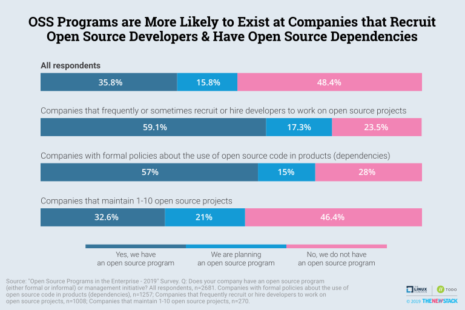

### Tech and Telecom Firms Most Likely to Have an Open Source Program

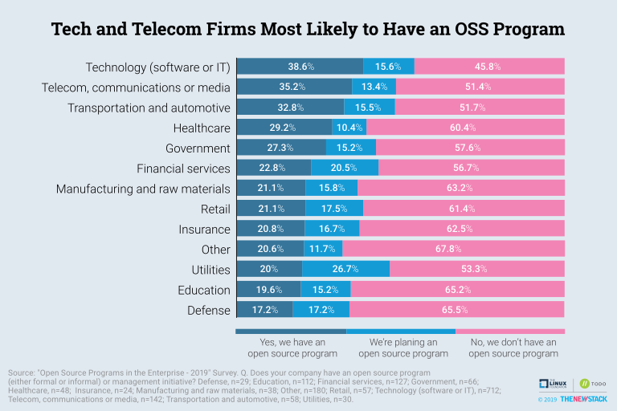

### Benefits of Open Source Programs

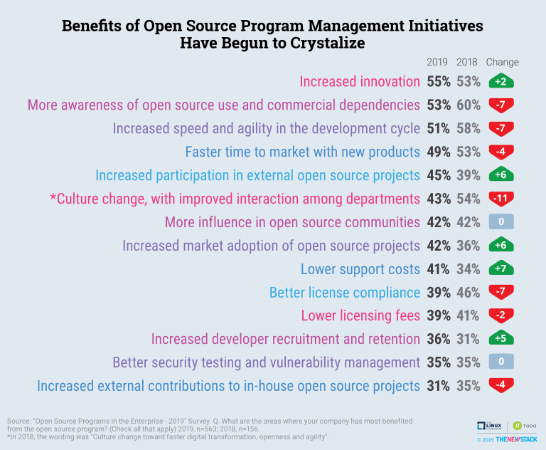

### Responsibilities of Open Source Programs

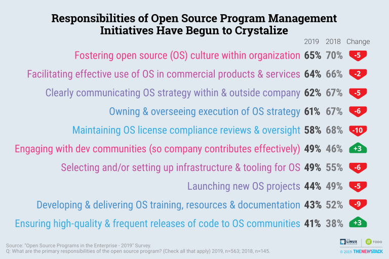

### Open Source Programs Are Beneficial

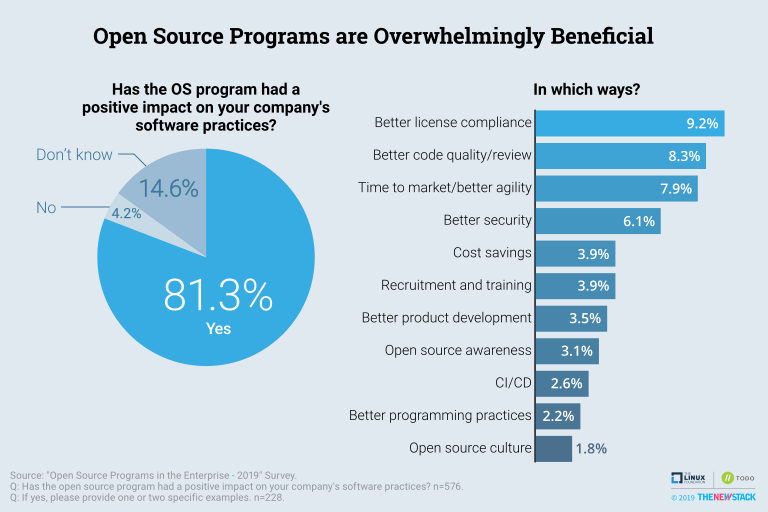

### Recruiting Is Increasingly a Challenge Facing Open Source Programs

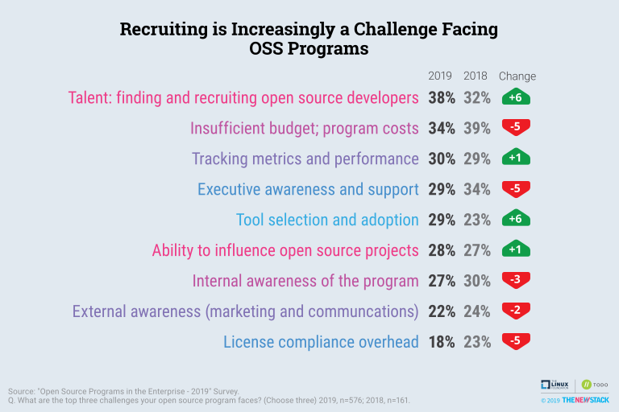

### Time to Market No Longer a Top Metric of Success for OSPOs

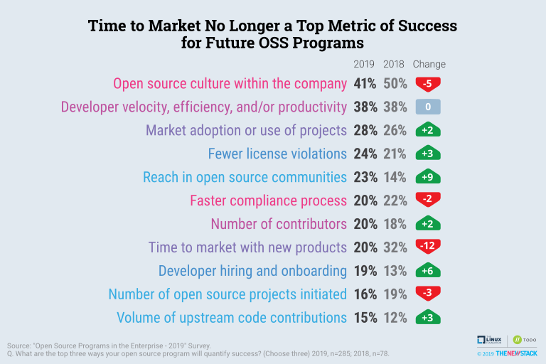

### Lack of Resources Less Likely to be Reason for No Open Source Program

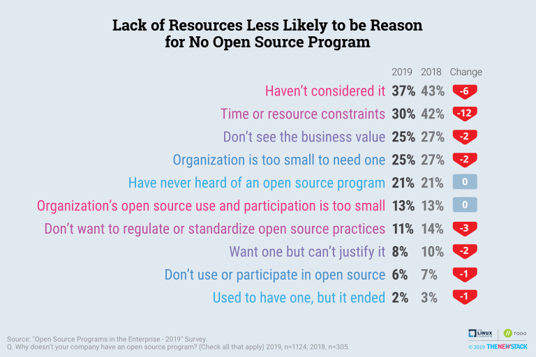

### Speed, Flexibility and Lower Costs Are Top Open Source Benefits

### Companies High Value their Open Source Foundation Memberships

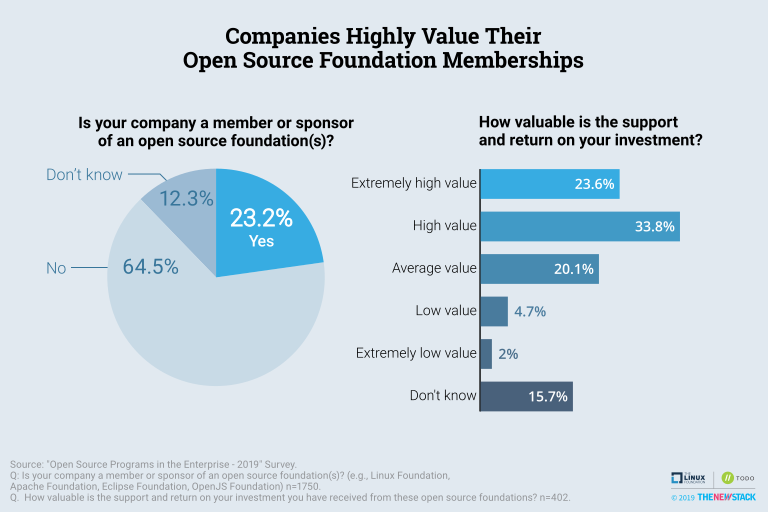

### Hiring Open Source Developers is Top of Mind for Open Source Programs

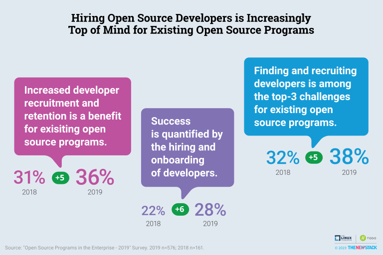

### No Consensus on Impact of Open Source Citizenship on Buying Decisions

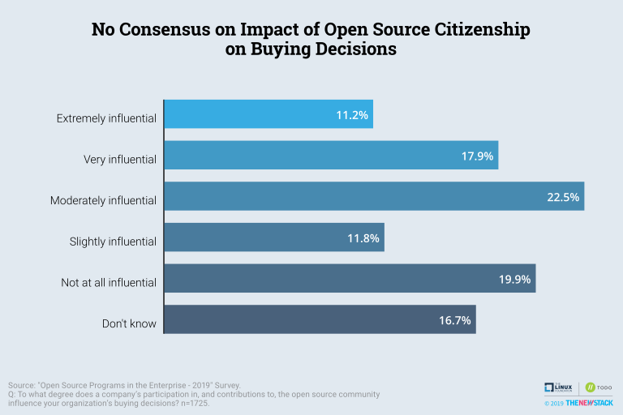

### 72% Think Google is an Above Average Open Source Citizen

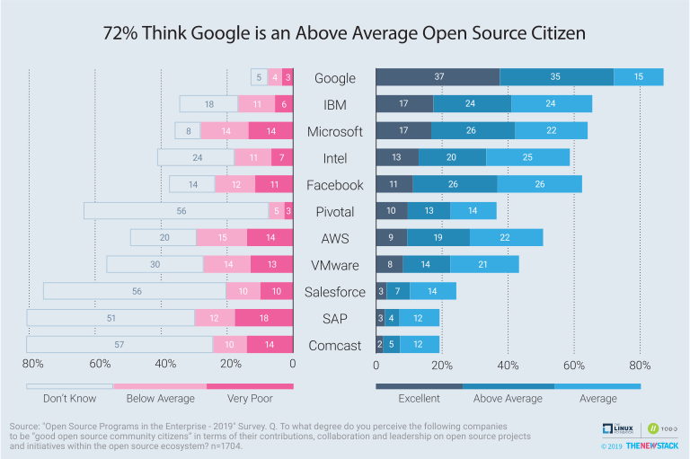

### The Most Actively Contributing Code Upstream View Microsoft and Intel More Positively. The Opposite is True for AWS.	

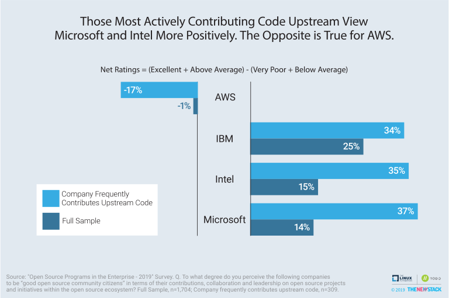

### Large Tech Companies Excel in Open Source Citizenship Metrics

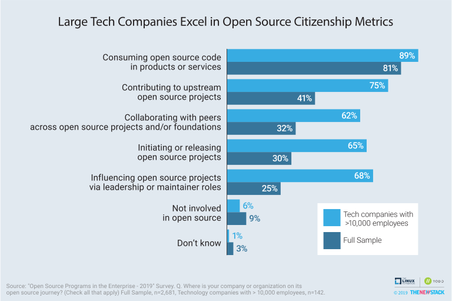

### Open Source Citizenship is Very Influential in Buying Decisions Among Companies Deeply Involved with the Community

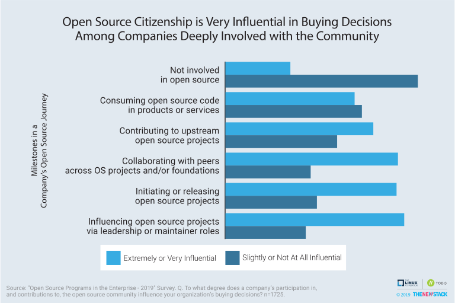

## License

The survey results are licensed under [CC-BY-SA v4.0](https://creativecommons.org/licenses/by-sa/4.0/)
