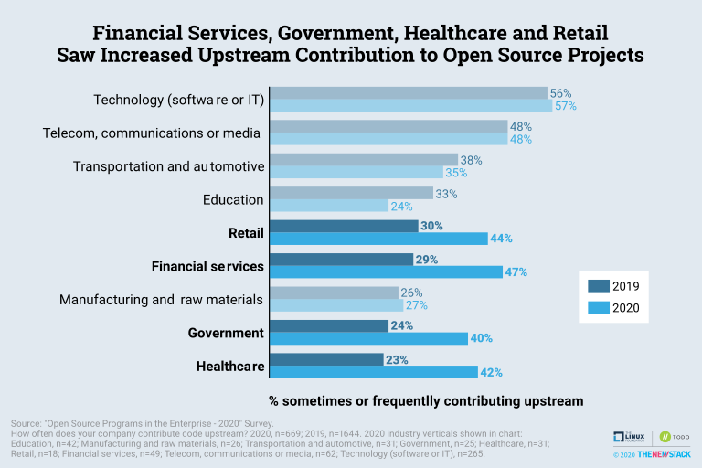
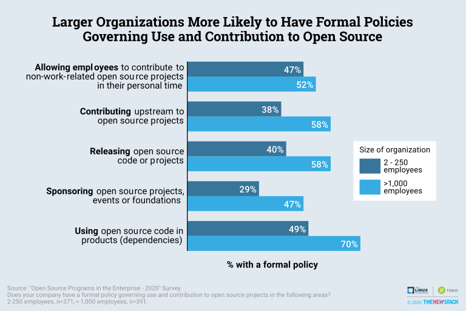

# 2020 Open Source Program Survey Results

The raw data from the survey is located here [results_2020.csv](results_2020.csv)

1026 people participated in the survey, which was conducted from May 5, 2020 to June 15, 2020. Company size was broadly represented, with 24% of respondents working at large companies with more than 10,000 employees, and 37% from small and mid-size companies with 250 or fewer employees. Developers and software engineers represented 40% of respondents, with at least another 34% holding an IT-related role.  

## Key Findings

* **Use of open source remains stable, and a new generation of companies are increasing their engagement with open source communities.** The increased engagement is not because organizations with OSPOs are contributing more -- 72% contribute code upstream, which is practically identical to the 2018 results. Instead, it is because organizations planning an OSPO are more likely to regularly create their own open projects, going from 35% in 2018 to 42% in 2020. Organizations planning an OSPO are also more likely to be influencing open source projects via leadership or maintainer roles, going from 18% to 24% over the last few years. 
* **Financial Services, Healthcare and Government all saw increased involvement with open source.** Almost half (47%) of financial firms involved with the survey are contributing code upstream, a jump from 29% last year. Healthcare and government organizations saw a similar increase, but these industry verticals are still less likely to have a formal policy governing use and contribution to open source.
* **Large organizations are more likely to have open source policies, while smaller organizations look for help influencing the broader community.** Seventy percent of respondents at an organization with over 1,000 employees have a formal policy governing the use of open source dependencies. In contrast, only 49% of the 2-250 employee cohort have that type of policy. Compared to those with more than 1,000 employees, the smaller organizations are twice as likely to say the top benefits of operating an OSPO are lower licensing fees and support costs. 
* **The economy impacts existing open source program offices**. In light of recent macroeconomic conditions, 37% believe funding for their initiative will increase in the upcoming fiscal year, while only 13% expect a decline. This optimistic outlook is being driven by nimble, smaller organizations looking to save money using open source.
* **The benefits of OSPOs and open source foundations continue to be appreciated.** 
Compared to 2019, respondents are slightly less likely to say an open source program is critical to the success of their engineering or product teams, but 56% still say it is very or extremely critical for success. Older programs are more valuable than younger ones, indicating that they have had success integrating into company processes.

## Charts

### Most companies are still early in the open source journey. They consume open source but aren’t yet active in upstream communities.

### Open Source Programs Have Narrowed Their Focus in the Past Few Years

### Focus on Hiring Open Source Developers Drops for Existing Open Source Program Offices

### Open Source Programs Optimistic About Funding Amid Economic Change

### Financial Services, Government, Healthcare and Retail Saw Increased Upstream Contribution Upstream

### Larger Organizations More Likely to Have Formal Policies Governing Use and Contributions to Open Source

### Open Source Program Offices (OSPOs) Become More Critical to Engineering Success

### OSPOs Come in All Shapes and Sizes

## License

The survey results are licensed under [CC-BY-SA v4.0](https://creativecommons.org/licenses/by-sa/4.0/)
